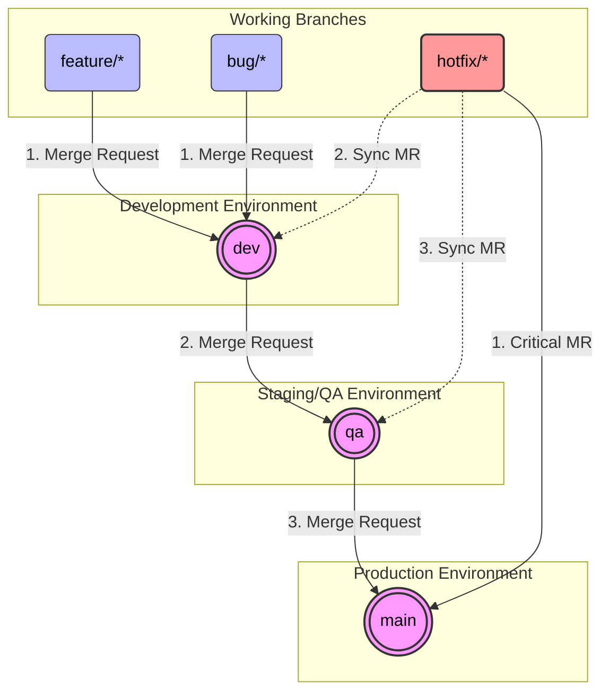

# Git Branching Strategy & Workflow Guide

This document defines the standard Git branching strategy, workflow rules, hotfix procedures, and rollback strategies for our repositories.

## � Terminology & Glossary

Different version control platforms use different names for the same concepts. To ensure everyone can easily understand and relate according to their specific platform, here is a mapping of common terms:

| Concept / Action | GitHub | Azure DevOps (Repos) | GitLab | Description |
| :--- | :--- | :--- | :--- | :--- |
| **Pull Request / Merge Request** | Pull Request (PR) | Pull Request (PR) | Merge Request (MR) | A formal request to review and merge code from one branch into another (e.g., merging a `feature` branch into `dev`). |
| **Repository (Repo)** | Repository | Repository | Project / Repository | The storage space where your project's files, branches, and commit history live. |
| **Branch** | Branch | Branch | Branch | An independent line of development (e.g., `main`, `dev`, `feature/*`). |
| **Commit** | Commit | Commit | Commit | A saved snapshot of changes to the codebase. |
| **CI/CD Pipeline** | GitHub Actions | Azure Pipelines | GitLab CI/CD | Automated workflows that build, test, and deploy code when changes occur. |

## �📊 Visual Representation

Here is a visual representation of how code flows from development to production.



---

## 🛡️ Protected Branches & General Rules

To ensure code stability, the core environment branches are heavily protected. **Direct commits/pushes are STRICTLY PROHIBITED.**

| Branch Name | Type | Rules |
| :--- | :--- | :--- |
| `main` | Production | **Protected.** Accepts Merge Requests ONLY from `qa` (standard flow) or `hotfix/*` (critical issue). |
| `qa` | Staging / Testing | **Protected.** Accepts Merge Requests ONLY from `dev` or syncs from `hotfix/*`. |
| `dev` | Implementation | **Protected.** Accepts Merge Requests ONLY from `feature/*`, `bug/*`, or syncs from `hotfix/*`. |

### Branch Naming Conventions
- **Feature:** `feature/<ticket-id>-<short-description>` (e.g., `feature/JNL-101-add-login`)
- **Bug:** `bug/<ticket-id>-<short-description>` (e.g., `bug/JNL-204-fix-button-color`)
- **Hotfix:** `hotfix/<ticket-id>-<short-description>` (e.g., `hotfix/JNL-911-payment-crash`)

---

## 🔄 Standard Workflow: Feature / Bug Development

All new features and normal bugs should branch from `dev` and merge back into `dev`.

### 1. Start Work (Branching from `dev`)
Always make sure your local `dev` is up-to-date before creating a new branch.
```bash
# 1. Checkout the dev branch
git checkout dev

# 2. Pull latest changes
git pull origin dev

# 3. Create and switch to your feature/bug branch
git checkout -b feature/JNL-101-add-login
```

### 2. Commit and Push Work
Commit your changes locally and push them to the remote repository.
```bash
# 1. Stage changes
git add .

# 2. Commit with a meaningful message
git commit -m "feat: added login screen UI and basic validation"

# 3. Push to remote
git push origin feature/JNL-101-add-login
```

### 3. Creating Merge Requests (Promoting Code)
Code is promoted across environments *strictly* via Merge Requests (MRs) or Pull Requests (PRs) in your Git UI (e.g., GitLab/GitHub/Bitbucket).

*   **Step 1:** Create MR: `feature/JNL-101-add-login` ➡️ `dev`. 
    *(Requires Code Review and CI passes prior to merge)*
*   **Step 2:** Once tested in Dev, Create MR: `dev` ➡️ `qa`.
*   **Step 3:** Once tested and approved by QA, Create MR: `qa` ➡️ `main`.

---

## 🔥 Hotfix Strategy

A hotfix is used exclusively for dealing with critical bugs occurring directly in the `main` (Production) environment that cannot wait for the standard release cycle.

**Rule:** Hotfixes branch off `main`, merge into `main` to fix production, and MUST be synced back to `dev` and `qa`.

### Hotfix Workflow
```bash
# 1. Checkout main and pull latest
git checkout main
git pull origin main

# 2. Create hotfix branch
git checkout -b hotfix/JNL-911-payment-crash

# ... perform the fix ...

# 3. Commit and push
git add .
git commit -m "fix: resolve null pointer in payment gateway"
git push origin hotfix/JNL-911-payment-crash
```

### Hotfix Merge Strategy
1.  **Deploy to Prod:** Create an MR from `hotfix/JNL-911-payment-crash` ➡️ `main`.
2.  **Sync to Dev:** Create an MR from `hotfix/JNL-911-payment-crash` ➡️ `dev`.
3.  **Sync to QA:** Create an MR from `hotfix/JNL-911-payment-crash` ➡️ `qa`.

*(Alternatively, you can cherry-pick the hotfix commit into dev/qa if massive merge conflicts arise).*

---

## ⏪ Rollback Strategy

If a bad deployment happens, we need a standard way to rollback. Because `main`, `qa`, and `dev` are protected, **we do not force-push (`git push -f`)**. Instead, we revert the problematic merge commit.

### Scenario A: Rolling back `dev` or `qa`
Frequent changes happen here. It is often faster to just submit a `bug/*` branch MR to fix the issue than to revert a massive merge. If you must revert, follow these steps:

```bash
# 1. Checkout the target branch (e.g., dev) and get latest
git checkout dev
git pull origin dev

# 2. Find the merge commit you want to undo
git log --oneline
# (Example output)
# b4c5d6e Merge branch 'feature/JNL-101-add-login' into 'dev'
# a1b2c3d Previous commit

# 3. Create a rollback branch from the target branch
git checkout -b rollback/revert-b4c5d6e

# 4. Revert the merge commit
# Note: For merge commits, you must specify the parent line using -m 1
git revert -m 1 b4c5d6e

# 5. Commit, push, and create MR to the target branch
git commit -m "revert: rollback feature JNL-101 (commit b4c5d6e)"
git push origin rollback/revert-b4c5d6e
```
*After pushing, open an MR from `rollback/revert-b4c5d6e` ➡️ `dev` and have it approved.*

### Scenario B: Rolling back `main` (Production Emergency)
If code hit `main` and broke production, you must revert the faulty merge commit securely.

```bash
# 1. Checkout main and get latest
git checkout main
git pull origin main

# 2. Find the merge commit you want to undo
git log --oneline
# (Example output)
# a1b2c3d Merge branch 'qa' into 'main'
# f9e8d7c Commit from older release

# 3. Create a rollback branch
git checkout -b rollback/revert-a1b2c3d

# 4. Revert the merge commit 
# Note: For merge commits, you must specify the parent line using -m 1
git revert -m 1 a1b2c3d

# 5. Commit, push, and create MR to main
git commit -m "revert: rollback bad release a1b2c3d"
git push origin rollback/revert-a1b2c3d
```
*Immediately open an MR from `rollback/revert-a1b2c3d` ➡️ `main` and approve it to undo the breaking changes.*

### Important Rule for Reverted Features
Once a feature merge is reverted via `git revert`, Git considers that feature's history "applied and undone". If you try to merge that exact same feature branch again later (after fixing the bug), **Git will ignore the older commits**. 

**To re-introduce a reverted feature:**
1. You must revert the *revert commit* itself, OR
2. Create a fresh branch from the original feature branch, make your fixes, and cherry-pick the commits or rebase.
